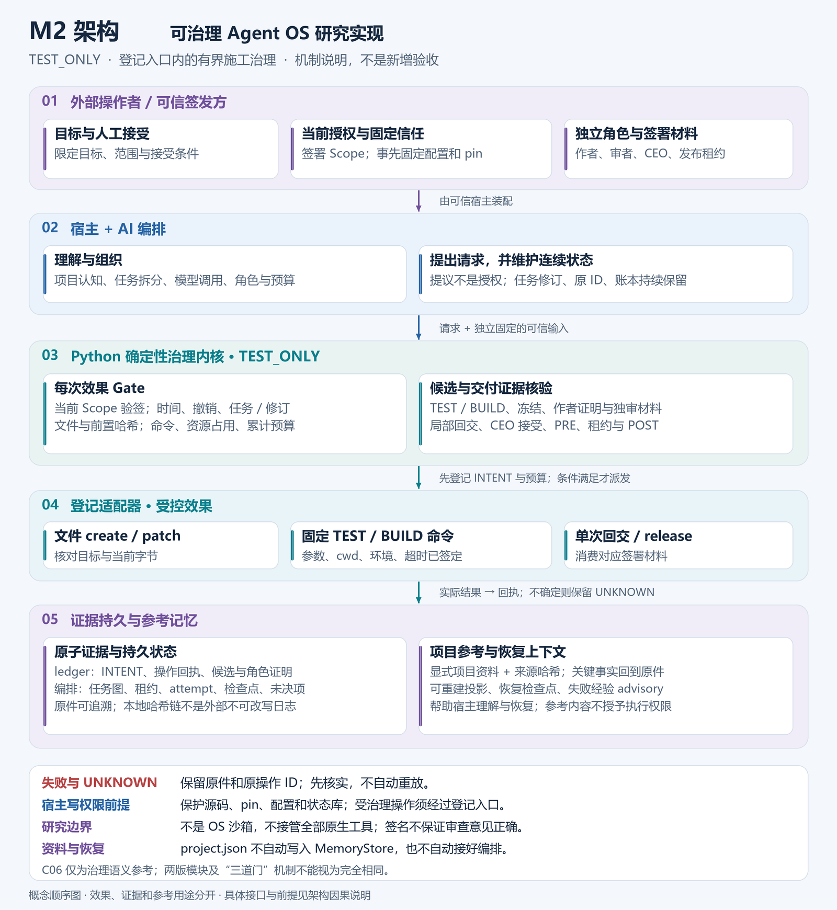
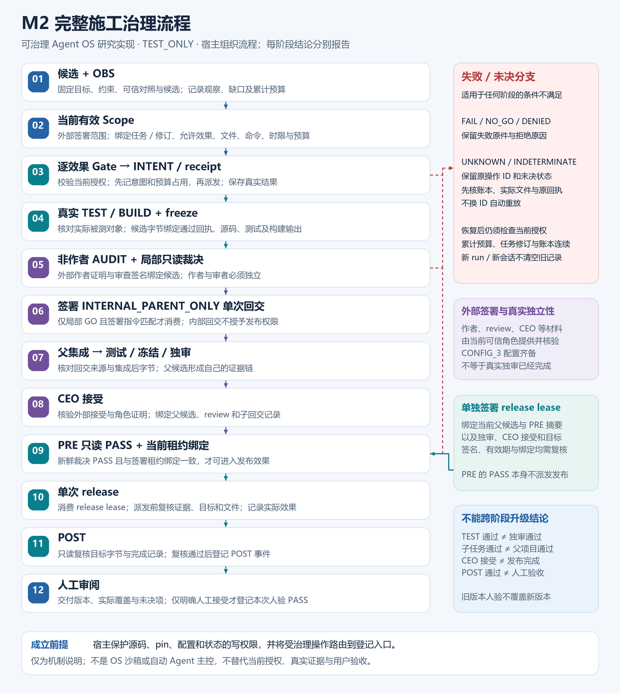

# M2 Construction Governance

**可治理 Agent OS 方法的 Python 研究实现。**

M2 研究一个具体问题：当 AI 参与持续开发时，如何让执行范围、实际效果、版本、审查和交付形成可核对的链路，而不是仅靠模型回答“我遵守了规则”。

本项目公开施工版源码、启动配置说明、架构与流程图，邀请同行复现、寻找反例、讨论治理方法并参与改进。这里的 **Agent OS** 指任务治理与编排的方法层；当前实现是 Python 内核与工具入口，尚不是具有进程隔离能力的操作系统或完整自主 Agent 平台。

**源码可见，限非商业学习与研究；商用另行书面授权。** 这是研究用途许可，不是 OSI 定义的开源许可证。权利人：yyf；研究合作与商业授权：**740237477@qq.com**。完整条款见 [LICENSE.md](LICENSE.md)。

## 阅读路线

| 你想了解什么 | 从这里开始 |
|---|---|
| 为什么采用这套方法 | [设计理念](docs/DESIGN.md) |
| 架构节点与因果关系 | [架构图](assets/architecture.png)、[逐节点说明](runtime/docs/ARCHITECTURE_CAUSALITY.md) |
| 从需求到交付的治理顺序 | [流程图](assets/workflow.png)、[完整操作流程](runtime/docs/WORKFLOW.md) |
| 安装、启动和配置自己的项目 | [配置指南](docs/CONFIGURATION.md)、[原始启动手册](runtime/START_HERE.md) |
| 如何复现、报告失败与边界 | [复现指南](docs/REPRODUCING.md)、[验证范围](docs/VALIDATION_SCOPE.md) |
| 已实现接口与源文件 | [内核 CLI](runtime/baseline/M2-Construction-Portable-20261004/core/docs/USAGE.md) |
| 参与什么、怎样参与 | [研究议题](docs/RESEARCH_AGENDA.md)、[贡献约定](CONTRIBUTING.md) |
| 来源、许可及专利边界 | [来源说明](docs/PROVENANCE.md)、[授权说明](docs/LICENSING.md) |

## 架构



AI 与宿主负责任务理解和编排；确定性 Gate 校验当前签名范围和效果；证据与持久状态支持恢复、审查和失败经验复用。记忆提供参考，不产生权限。框架只治理经过登记入口的操作，宿主仍负责实际身份映射、文件权限与隔离。

## 执行流程



候选与 OBS → 当前范围授权 → 每次效果 Gate、意图和回执 → 实际 TEST/BUILD 与冻结 → 非作者审查 → 局部只读裁决及单次内部回交 → 父集成验证 → CEO 接受 → 发布前只读裁决 → 单次受控发布 → POST → 按约定人工验收。

这里的 CEO 是父级接受职责，不自动等于真人验收。只读裁决不签发权限；签名发布租约必须另行有效且与当前候选绑定一致。失败和 UNKNOWN 原样保留。

## 第一次运行

需要 Python 3.11+，在本仓库外创建虚拟环境并安装 [runtime/requirements.txt](runtime/requirements.txt)。完整 Windows/macOS/Linux 命令见配置指南。从仓库根目录执行：

```text
python -I -B runtime/m2.py doctor
python -I -B runtime/m2.py workflow
```

使用你的实际 Python 解释器；部分系统命令名是 `python3`。`doctor` 检查环境与包内字节，`workflow` 输出步骤说明；两者都不会自动调用大模型、施工、签发权限或完成验收。

`runtime/` 是有清单校验的完整运行包。不要在其中创建 `.git`、虚拟环境、缓存、项目配置或运行输出。Git 元数据位于仓库根；运行状态放到仓库外。更改运行包形成新候选后，需要相应审查与版本记录，不能通过直接改清单把旧验收挪给新代码。

## 当前可验证到哪里

- 固定内核源自 CK-FINAL-20260928-01；其历史人工接受只适用于原版本与原验收范围。
- 随附便携入口有 Windows / Python 3.13.11 / cryptography 46.0.3 的限定检查记录；macOS/Linux 未完成实机验证。记录见 [runtime/VALIDATION.md](runtime/VALIDATION.md)。
- 当前使用 `TEST_ONLY` 信任域，未附历史私钥、客户配置或业务数据。公开资料不代表已经完成生产身份部署。
- 本次社区文档、图件和仓库整理属于发布候选；不能当作外部独立复现已经成功。欢迎提交可核对的复现结果与反例。

本项目不承诺任意长任务永不漂移，不把本地哈希链描述为对高权限宿主绝对不可篡改，也不声称接管全部原生工具。上述条件和未覆盖项是研究对象的一部分。

## For researchers

M2 is a Python research implementation of a governable Agent OS method: bounded signed scopes, per-effect gates, intent/receipt records, frozen candidates, independent review evidence, controlled return/release, and persistent evidence-based context. It is **source-available for non-commercial learning and research**, with separate commercial licensing. It is not an OS sandbox or a universal tool interceptor. We welcome reproducible findings, counterexamples and discussion; external validation is not presumed.

Maintainer: **yyf** · **740237477@qq.com**. See [research topics](docs/RESEARCH_AGENDA.md), [contribution terms](CONTRIBUTING.md) and [license](LICENSE.md).
