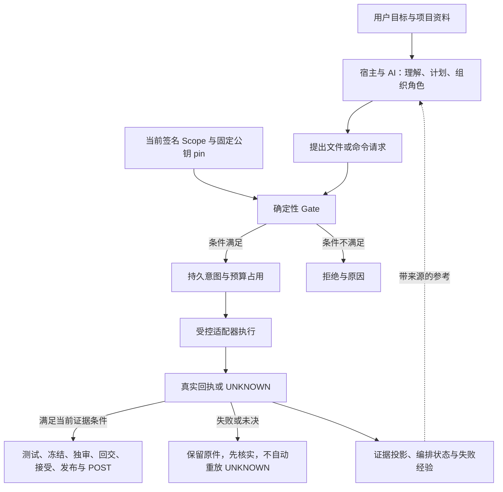

# 设计：把 Agent 的提议、执行权限与证据分开

本项目公开一套“可治理 Agent OS”方法的 Python 参考实现，供学习、复现和研究。这里的 Agent OS 指组织任务、权限、证据、记忆与交付的运行方法；当前实现提供登记入口内的施工治理组件，由外部宿主组织模型和角色。它没有接管电脑上的全部工具，也没有实现 OS 沙箱。

源码按本仓库许可供学习与研究使用，商业使用须另行授权。公开源码不代表采用 OSI 开源许可；具体权利与限制以仓库许可文件为准。

## 1. 出发点与可检验的主张

模型可以提出有用方案，也可能误解业务、引用旧结论或漏掉检查。自然语言中的“已批准”“已测试”“已完成”不能独自建立执行权限或证明效果发生。

因此，本实现把可明确表达的约束放进程序：每次受控操作核对当前授权，执行前登记意图，执行后保存真实回执，再把测试、候选、审查与交付绑定到同一对象。研究者可以检查这些条件在何种输入和故障下有效，而不必接受“模型会自行遵守”的假设。

| 要降低的风险 | 对应机制 | 仍需验证的条件 |
|---|---|---|
| 提议越出用户范围 | 签名 Scope 绑定任务、修订、文件、效果、命令、期限和预算；每次 Gate 重新核对 | Scope 是否准确表达用户意图，实际操作是否经过登记入口 |
| 修改落在旧版本或错误文件 | 修改前哈希、路径和当前候选检查 | 跟踪文件是否覆盖真实被修改/被测试对象 |
| 崩溃后重复产生效果 | operation ID、先登记意图、实际回执和 UNKNOWN 保留 | 宿主是否保留原账本，并先核实未决效果 |
| 测试 A，却审查或交付 B | TEST/BUILD 回执与冻结候选字节绑定 | 测试是否覆盖需求，外部构建路径是否读取同一候选 |
| 作者自行宣布通过 | 作者证明、不同审查者指纹、绑定候选的签名 review | 宿主身份映射和审查工作是否实际独立，审查意见是否正确 |
| 子任务通过被误当成发布批准 | 内部回交、父集成、CEO 接受、只读 PRE 和独立 release lease | 父级验证与发布出口是否按当前授权装配 |

这些机制约束执行与证据关系，不证明所有业务判断正确，不承诺“零幻觉”或任意长任务永不漂移。

## 2. 三类职责

AI 与宿主负责理解和组织。Python 内核判断程序可核对的条件，并派发规定效果。持久证据支持恢复与复核。三者需要接线：仅把图写进提示词不会自动建立程序门控。

实现入口可从 [m2.py](../runtime/m2.py) 进入，再读 [Controller](../runtime/baseline/M2-Construction-Portable-20261004/core/src/m2_construction/controller.py)、[trust](../runtime/baseline/M2-Construction-Portable-20261004/core/src/m2_construction/trust.py) 和 [adapters](../runtime/baseline/M2-Construction-Portable-20261004/core/src/m2_construction/adapters.py)。更完整的静态因果说明保留在 [运行时架构说明](../runtime/docs/ARCHITECTURE_CAUSALITY.md)。

## 3. 原子证据与编排记忆为何同时存在

只存聊天摘要，会丢失“做了什么、是否真正发生、对应哪个候选”的核对依据。只存原日志，又不能直接告诉接手者当前任务停在哪里。因此实现区分原件、编排状态与可重建的上下文。

| 层次 | 内容与用途 | 权限边界 |
|---|---|---|
| 原子证据 | ledger 事件、签名授权、操作意图与回执、冻结候选；按操作和对象核对 | 本地完整性校验不等于外部不可改写存证 |
| 编排状态 | 任务图、阶段、attempt、角色/文件租约、检查点、待审和未决 ID | `OrchestrationStore` 保存状态与恢复约束，没有自动执行器 |
| 内核记忆与证据投影 | 记忆提议、核验状态、来源与绑定；从原件构造可重建投影和上下文 | 检索结果与摘要只是建议；不能覆盖 Gate 或消除 UNKNOWN |
| 项目知识配置 | 明确列出的需求、设计、代码、测试、决策、问题、记忆与证据文件 | 包装层参考输入，不自动写入内核 MemoryStore，也不授予授权 |

阅读路径：[ledger.py](../runtime/baseline/M2-Construction-Portable-20261004/core/src/m2_construction/ledger.py) → [orchestration.py](../runtime/baseline/M2-Construction-Portable-20261004/core/src/m2_construction/orchestration.py) → [memory.py](../runtime/baseline/M2-Construction-Portable-20261004/core/src/m2_construction/memory.py) → [evidence_projection.py](../runtime/baseline/M2-Construction-Portable-20261004/core/src/m2_construction/evidence_projection.py) → [context.py](../runtime/baseline/M2-Construction-Portable-20261004/core/src/m2_construction/context.py)。

恢复时，应以当前授权和原件核对任务修订、候选、租约、累计预算与未决操作。新对话或 run2/run3 不构成重置预算、遗忘失败或换 ID 重放 UNKNOWN 的理由。

## 4. 失败经验是有条件的参考

失败复用保留原始失败、原因是否已核实、相关依赖、适用条件和更正关系。原因未知与效果未知分别记录。新任务可以引用旧经验，但不能继承旧权限，也不能把原失败改成成功。

经验是否适用取决于相关逻辑、规则、接口、场景与来源证据。年龄、旧授权到期或无关文件改变本身，不应抹去经验价值。相反，同名错误并不足以证明同一根因。

当前接点是原工具桥保存回执后的可选入档，以及显式 `prepare-context`；不是所有宿主和直接 CLI 调用都自动接入。见 [失败经验说明](../runtime/baseline/M2-Construction-Portable-20261004/docs/FAILURE_EXPERIENCE.md) 和 [实现](../runtime/baseline/M2-Construction-Portable-20261004/src/m2_construction/failure_experience.py)。相关结论仍需要真实支持证据，不能使用总返回 true 的核验回调代替。

## 5. 完整治理链与成立前提

当前范围授权 → 每次效果 Gate → 意图与回执 → 真实 TEST/BUILD → 冻结候选及作者证明 → 非作者审查 → 局部裁决与单次内部回交 → 父集成验证 → CEO 接受 → 发布前只读裁决 → 独立租约下的单次发布 → POST。

PRE 的 PASS 是当前证据满足裁决条件，发布还要单独授权。签名 review 证明其签署身份与对象绑定，不保证自然语言论证正确。POST 验证某次目标状态，不能永久保证目标不再变化。操作细节见 [运行时流程](../runtime/docs/WORKFLOW.md) 和 [状态说明](../runtime/docs/STATUS_MEANING.md)。

成立前提包括：可信方提前固定配置与 pin；原始状态和发布出口受到相应部署保护；宿主真实组织作者、独审和接受；所宣称受治理的效果经过规定入口。拥有额外宿主写权限的进程仍可能绕过 Python 入口，不能据此声称全局工具拦截、自动原生 Agent 身份认证或 OS 级隔离。

## 6. 版本与证据边界

本公开派生版标识为 `M2-RESEARCH-20261006-RC1`。`runtime/` 来自便携 R2：运行时代码及其嵌入的 53 个父包成员保留原字节，三个方法参考文档已作公开表述泛化，并更新包装清单；不能把整个公开 runtime 说成 R2 逐字节副本。方法文档变化也不构成新的运行证据。

治理来源为 CK-FINAL-20260928-01。2026-09-28 原内核的人工 PASS 只属于当时固定版本和范围；便携新版本、此研究仓库和外部项目不能继承该结论。

已有记录限于 Windows/Python 3.13.11/cryptography 46.0.3 下的便携入口与项目资料限定检查。R2 增补文档、复用相同代码的 R1 运行记录；macOS/Linux 未实机验证。当前记录不证明社区独立复现、其他模型接入或外部业务项目已经成功。详见 [VALIDATION.md](../runtime/VALIDATION.md) 与 [机器可读记录](../runtime/PORTABLE_VALIDATION.json)。

施工版提炼过 C06 的治理语义，但为独立 Python 工程，不在运行时导入 C06；此仓库不交付 C06 业务系统。概念上的相似门控不能代替逐模块、逐版本核对。

下一步可读 [配置说明](CONFIGURATION.md)、按 [复现步骤](REPRODUCING.md) 建立自己的记录，或从 [研究议题](RESEARCH_AGENDA.md) 选择一个可证伪的问题。
