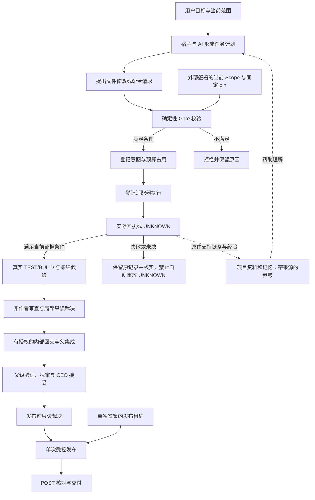

# 架构因果说明：为什么这些环节能够形成施工治理

适用版本：CK-FINAL-20260928-01 治理内核及 CK-PORTABLE-START-20261006-01 便携入口；本文是文档增补 R2。以随包源码静态阅读为依据，说明机制、成立条件和边界，不增加运行权限，也不是一次新测试或项目验收。

## 1. 设计要解决什么问题

AI 可以理解要求、提出计划和生成代码，但它的自然语言回答不能替代执行授权、实际执行记录或验收证据。因此，这套架构把三类职责分开：

| 职责 | 负责什么 | 为什么需要分开 |
|---|---|---|
| AI 与宿主编排 | 理解项目、拆任务、组织角色、提出修改和审查意见 | 业务判断需要上下文，模型也可能理解错误；提议不能直接扩张权限 |
| Python 确定性治理 | 校验当前签名范围、任务版本、文件和命令、预算、候选及效果消费 | 将可明确表达的硬约束落实成程序条件；不依赖模型自称“遵守了” |
| 原始证据与持久状态 | 保存意图、实际回执、冻结候选、角色证明、未决操作和恢复检查点 | 换进程或换对话后，下一步仍能核对真实停点，不凭摘要猜测 |

治理成立的关键因果是：**相关操作必须经过检查入口，入口使用当前可信状态判定，只有满足条件的操作才派发，派发与结果有持续记录。** 仅在提示词中描述同样流程，不会自行建立这些约束。

## 2. 三层如何配合

不支持 Mermaid 的阅读器可按这一顺序理解：项目理解 → 当前授权 → 每次效果 Gate → 意图/回执 → 测试与冻结 → 独审和局部裁决 → 内部回交与父集成 → CEO 接受 → 发布前裁决 → 单次发布 → POST。

图展示职责与先后条件。宿主负责组织这些步骤；便携包没有一个自动调用模型、自动签署证明并一路执行到验收的主控。

## 3. 每个环节为何存在

| 环节 | 当前机制及核对对象 | 因果作用：少了它会怎样 |
|---|---|---|
| 固定可信入口 | 提前审核配置哈希，固定工作区、外部状态、公钥 pin；桥另绑定解释器及内核 capture | 若请求能自行选择信任配置，调用者就可能用自己的公钥和规则给自己授权 |
| 当前范围授权 | 验证签名 Scope；绑定任务/修订、工作区与状态、允许文件/效果/命令、有效期及预算 | 将“一次授权做完任务”限定为有边界的任务，避免口头同意变成无限权限 |
| 每次效果 Gate | 每次重新核对已存签名授权、撤销状态、时间、任务版本及效果条件 | 首次获准后仍可能过期、撤销或改变任务；只在启动时检查不能约束后续操作 |
| 文件版本和资源占用 | 校验目标路径及当前字节、修改前哈希、资源占用；命令使用预先签定的参数、cwd、环境和超时 | 防止把修改落在错误文件/旧版本，避免请求临时换成另一条任意命令；命令进程本身的能力仍取决于宿主权限 |
| 先意图、后派发、再回执 | 保存 operation ID、请求绑定、预算使用、INTENT 和真实结果；未决效果保留 UNKNOWN | 如果先执行后记账，崩溃时可能无法判断是否已经发生效果；直接重试可能产生重复修改或发布 |
| 真实测试与冻结 | 固定候选绑定实际 TEST/BUILD 操作、源文件、测试文件、构建输出和字节哈希 | 避免测试的是 A、审查和交付却是 B。仍须人工/宿主检查测试是否真正覆盖需求，及外部构建路径是否对应候选 |
| 作者证明与独立审查 | 外部作者证明、独立 reviewer 签名绑定同一候选、测试回执和冻结事件；作者与审者指纹必须不同 | 降低作者直接自称审查通过的风险。程序验证角色证明与绑定，不会自动证明自然语言审查意见正确 |
| 局部裁决和内部回交 | 局部 GO 后，还要独立签署的回交指令，绑定父/子任务、文件和目标，单次 INTERNAL_PARENT_ONLY | 子模块合格只允许规定的内部回交，不能据此取得整个产品的对外发布权限 |
| 父集成与 CEO 接受 | 父候选重新验证，核对独审、子回交来源和角色证明，记录绑定父候选的 CEO 接受 | 子模块分别通过不代表组合后满足要求；集成改变了对象，必须核对集成后的实际成果 |
| 发布前只读裁决 | 根据当前候选、回执、审查与接受证据返回 PASS/FAIL/INDETERMINATE | 将“材料是否满足条件”与“是否允许产生发布效果”分开；裁决本身不能补发权限 |
| 发布租约与 POST | 独立签署 release lease，固定目标和文件；消费时复核，再校验实际发布字节及完成记录 | 避免将同一批准用于另一目录或另一候选；POST 核的是实际落地结果，不能只相信“复制成功”的声明 |

实现入口：[trust.py](../baseline/M2-Construction-Portable-20261004/core/src/m2_construction/trust.py)、[controller.py](../baseline/M2-Construction-Portable-20261004/core/src/m2_construction/controller.py)、[adapters.py](../baseline/M2-Construction-Portable-20261004/core/src/m2_construction/adapters.py)、[review.py](../baseline/M2-Construction-Portable-20261004/core/src/m2_construction/review.py)、[adjudication.py](../baseline/M2-Construction-Portable-20261004/core/src/m2_construction/adjudication.py)、[pre_release.py](../baseline/M2-Construction-Portable-20261004/core/src/m2_construction/pre_release.py)、[release_effect.py](../baseline/M2-Construction-Portable-20261004/core/src/m2_construction/release_effect.py)。

## 4. 为什么还需要项目知识与持久记忆

治理规则能决定“是否允许改这个文件”，但不能仅凭文件白名单知道“这个业务字段应该怎样计算”。因此要同时保留项目认知和治理事实，并让二者承担不同职责。

| 内容 | 本版实现位置与作用 | 不能自动做到什么 |
|---|---|---|
| 项目知识配置 | 包装层 project.json 明确列出需求、设计、代码、测试、决策、问题、记忆、证据；每次加载核对文件哈希与登记关系 | 不自动扫描整个项目、不理解所有业务、不把资料中的命令当指令；哈希一致不证明内容正确 |
| 治理证据 | 内核 ledger 保存原子事件和操作回执，供核对状态与链路 | 本地哈希链不是外部不可改写日志；具有状态库改写权限的宿主仍需独立保护 |
| 编排持久状态 | OrchestrationStore 保存任务图、角色/文件租约、阶段、attempt、检查点、待审和未决操作；恢复时核对当前绑定 | 它保存和校验编排状态，不自动启动所有角色或完成施工 |
| 证据投影与上下文 | 从原件生成可重建投影，绑定来源 head、任务及版本；关键约束和 UNKNOWN 不能被摘要悄悄消除 | 摘要、投影和模型陈述不授予权限；宿主必须实际接线，不能用缓存冒充当前原件 |
| 失败经验 | 保留原失败、已证原因或假设、证据、相关依赖与适用条件；新任务生成 advisory 引用 | 不继承旧授权、不把旧失败改成成功、不自动重放 UNKNOWN；不保证同名问题具有同一根因 |

旧经验不会仅因年龄、旧任务授权到期或无关代码更新而丢失价值。需要复核的是与经验相关的逻辑、规则、接口、场景和原证据是否变化。当前项目资料加载器按显式元数据排除冲突/过期/被替代来源；适用性与语义判断仍由操作者或宿主依据证据完成。

特别注意：新包装层的 project.json **不会自动写入内核 MemoryStore，也不会自动替宿主接好 OrchestrationStore**。它解决接手方“从哪些真实项目资料开始理解”的问题；内核证据恢复与失败经验通过各自原接口使用。

实现入口：[project_context.py](../portable/project_context.py)、[orchestration.py](../baseline/M2-Construction-Portable-20261004/core/src/m2_construction/orchestration.py)、[context.py](../baseline/M2-Construction-Portable-20261004/core/src/m2_construction/context.py)、[failure_experience.py](../baseline/M2-Construction-Portable-20261004/src/m2_construction/failure_experience.py)。

## 5. 一项任务的因果推演

以下是解释机制的假设场景，不是本次新增实测：当前签名 Scope 只允许修改一个指定源文件、执行一条固定测试命令，并给出操作预算。

1. AI 提出修改另一个未授权文件：文件/效果范围不满足，受控入口拒绝。项目记忆里写“以前允许”不会改变当前 Scope。
2. AI 提出修改允许文件，但它已被别的操作改变：当前字节与指定修改前哈希不符，不能直接覆盖；先重新核对当前候选。
3. 测试通过后又改了待交付文件：旧回执和冻结绑定不能自然证明新字节合格。只有实际满足当前候选对应的验证条件，才能继续交付链。
4. 一个命令超时且是否完成无法确认：保留原 operation ID 和 UNKNOWN，不以新 ID 自动再执行一遍。这样避免把“没收到结果”误认为“没发生效果”。
5. 子任务 review GO：还需受控内部回交和父集成验证；它不是产品发布批准。
6. 发布前裁决 PASS：仍需当前签名发布租约。发布后再次核对目标文件，才能记录对应 POST；此后目标字节再变，旧 POST 不构成永久正确保证。

这些约束能减少越权、错版本、重复效果与证据错用。测试选错用例、业务口径理解错误或审查遗漏，仍可能影响成果质量，因此需求确认和独立审阅不可由状态名称替代。

## 6. 与 C06 和“三道门”图的对应关系

施工版提炼了 C06 的治理语义，是独立 Python 工程，不在运行时导入 C06。两者可以用同一套职责概念解释，但不能把概念图上的每个框当成两版完全相同的模块。

| 图上的概念 | C06 固定版 | 本施工版 |
|---|---|---|
| 身份/入口门 | 官方业务入口、实例、角色与任务绑定；不是任意外部 Agent 身份认证平台 | 当前任务与范围、外部作者/审者证明；不自动认证原生 Codex 调用者身份 |
| Root 验证门 | Ed25519 验签，同时绑定源码清单、Gate、策略、domain/instance/epoch | 固定 pin 校验签名 Scope、角色和发布等材料；工具桥另校验 capture；不是一套与 C06 完全相同的框架证书验证流程 |
| 执行门 | 受控模型和登记的业务能力，审批、预算、数据源/组织/期间等检查 | 受控文件操作、固定 TEST/BUILD 命令、当前范围/版本/预算检查 |
| 交付门 | TEST、独立 AUDIT、只读裁决、单次 HTML/CSV 交付及查看/下载复核 | 冻结、独审、内部回交、父集成、CEO 接受、发布前裁决、单次发布与 POST |

图中“Root 证书有效期/CRL”不能笼统写成两版都完整实现：C06 的框架绑定使用 epoch 和冻结机制，业务批准另有有效期；施工版 Scope 有有效期和撤销机制。图中“不可篡改日志”应改为“持久记录与完整性校验”，除非具体部署另有已验证的外部不可改写设施。

C06 对照来源为固定发行包 BEV2-ERP-Assistant-Local-20260924-G0-C06，SHA256 `e35d3129d1a7ad5c76db079bfe5ec0af44f38a5b7feb697a1cf11e4342afbe7c`。对应源码为 `deployment/src/business_v2/trust_binding.py`、`kernel_bridge.py`、`delivery.py` 及 `deployment/kernel/src/yingqi_m2_r2/journal.py`。这些 C06 文件不嵌入本施工包；此处只是此前固定源码静态核对的对照说明，不新增 C06 测试或验收结论。

## 7. 成立条件与准确的对外表述

沿用可信离线签发和固定公钥的前提，宿主还须正确装配当前范围、状态与独立角色，确保所宣称受治理的资源操作经过受控入口。框架源码、公钥配置和状态库的实际写权限由部署环境管理；包内 Python 代码不会自行建立整个电脑的隔离。

本施工版可以准确表述为：**对登记入口内的有界施工效果，提供当前授权检查、真实效果证据、候选绑定、独立审查材料核验、受控回交和发布，以及持久恢复与失败经验接口。**

不能据此声称它已经接管 Codex 的全部原生工具、自动识别每个 AI 的真实身份、建立 OS 沙箱，或保证任何长任务永不漂移、任何审查意见都正确。

使用时先读 [启动指南](../START_HERE.md)，按 [完整流程](WORKFLOW.md) 装配当前任务，再用 [状态说明](STATUS_MEANING.md) 区分启动、执行、测试、审查、发布和人工验收。
